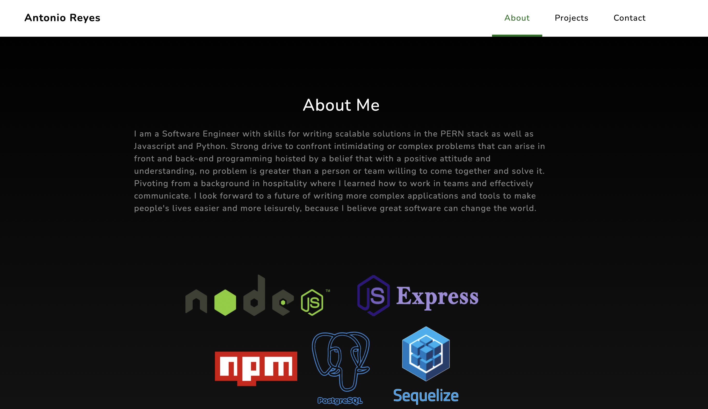
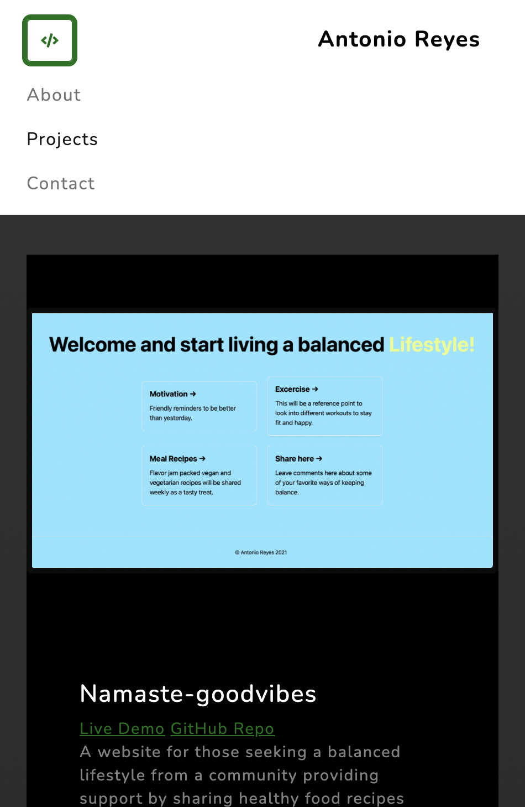
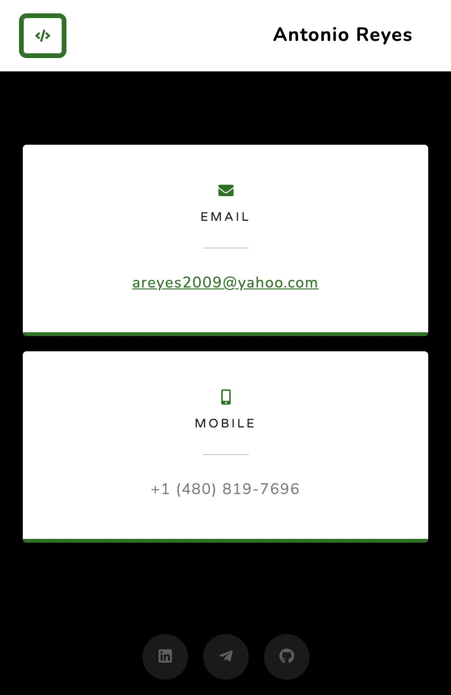

# Portfolio

I am Antonio Reyes a Software Engineer with a passion for learning more about software engineering. As an avid learner I look forward to building more complex features and applications.

## Technologies used

HTML
CSS
JavaScript
BootStrap

## Approach

I wanted a sleek user friendly website to host all my projects for everyone to enjoy. Using
JavaScript, HTML, CSS and Bootstrap for a linear gradient effect in the background this website is responsive to fit all devices.

##### Screenshot(s)

Desktop version

Mobile version

