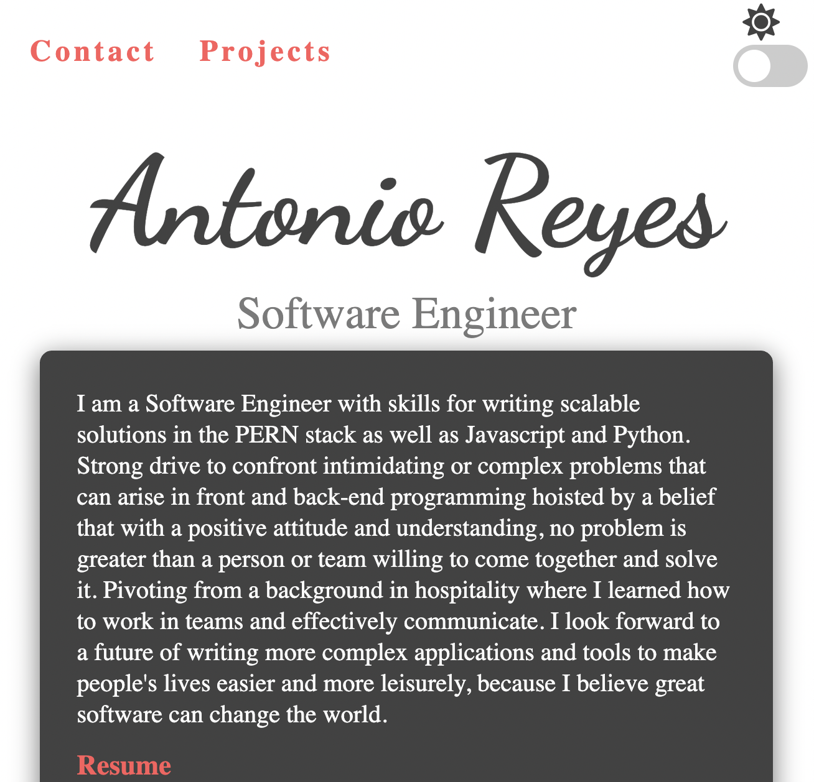
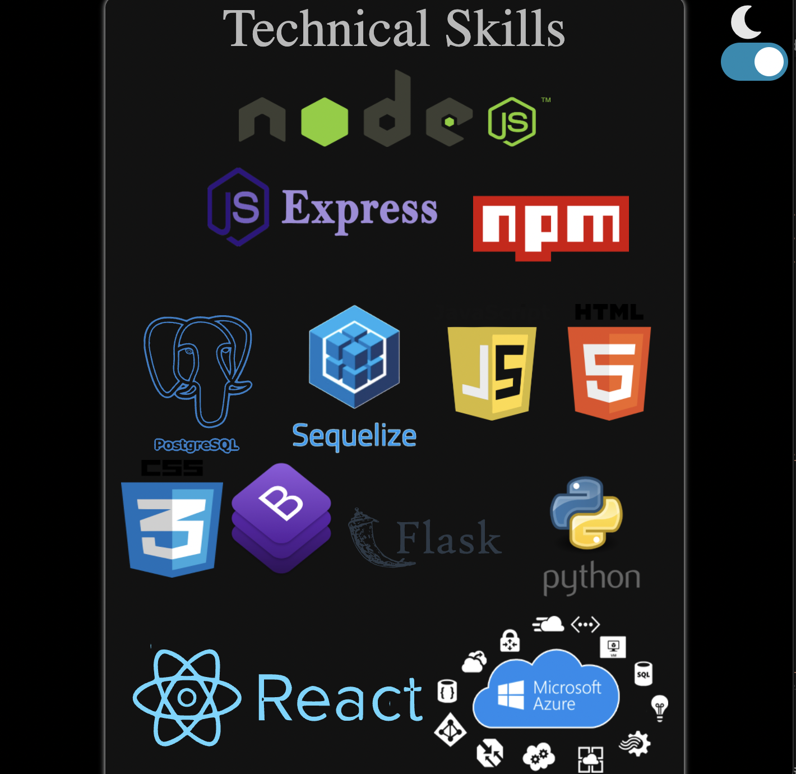
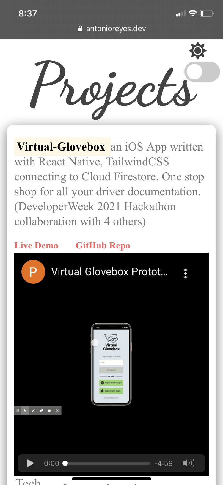
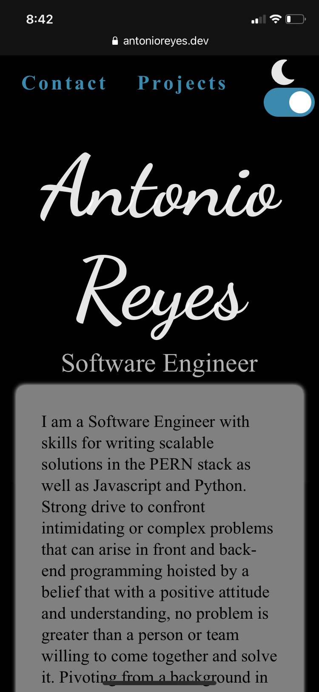

# Portfolio

I am Antonio Reyes a Software Engineer with a passion for tech interested in learning more about tech and growing into more complex applications.

## Technologies used

HTML
CSS
JavaScript
BootStrap

## Approach

I wanted a clean user friendly website to host all my projects for friends and family to enjoy. Using vanilla JavaScript and some bootstrap I am inspired using the dark mode feature on the top right corner to help viewers see content thats easier on the eyes.

##### Screenshot(s)

Desktop version

Dark Mode Skills SVG images

Mobile version

#### Unresolved issues

working in a parallax however not compatible with some browsers seeking alternative solution for design
