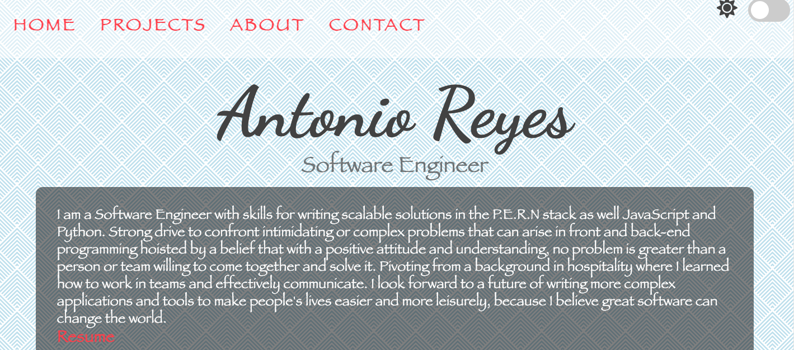
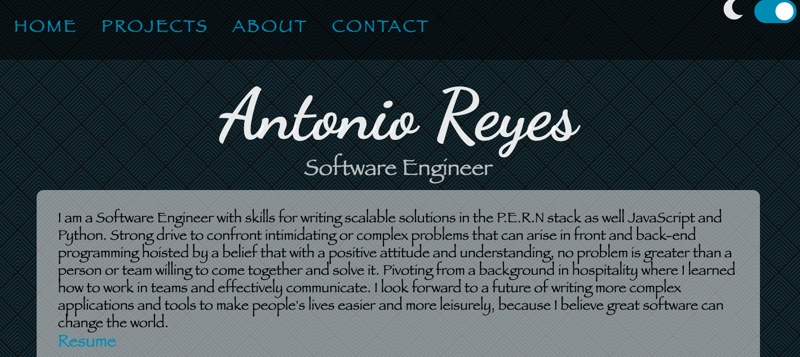
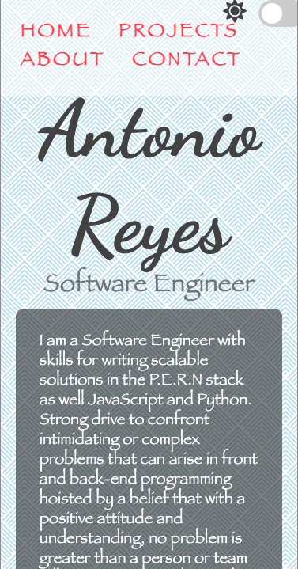
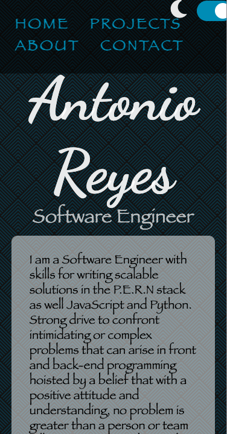

# Portfolio

I am Antonio Reyes a Software Engineer with a passion for tech interested in learning more about tech and growing into more complex applications.

## Technologies used

HTML
CSS
JavaScript
BootStrap

## Approach

I wanted a clean user friendly website to host all my projects for friends and family to enjoy. Using vanilla JavaScript and some bootstrap I am inspired using the dark mode feature on the top right corner to help viewers see content thats easier on the eyes.

##### Screenshot(s)

Desktop version

Mobile version

#### Unresolved issues

The social media icons need to be in a row vs column in the contact section. The nav bar does not fit the top of the page once in mobile version for the contact section because of the icons being in a column.
